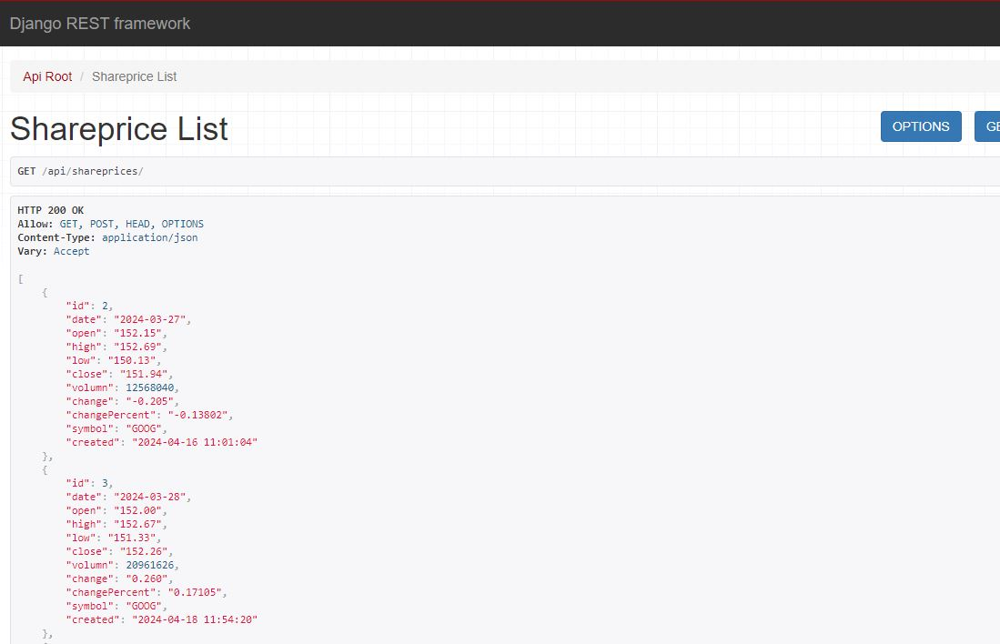

# DataAPI
Build data API backend using Djangle. The API data is shown below

## Run the code
`$python manage.py runserver`

## Operation
This operated by using the Streamlit, the example is at the repository of [DataANa](https://github.com/ych2tj/DataAna)
